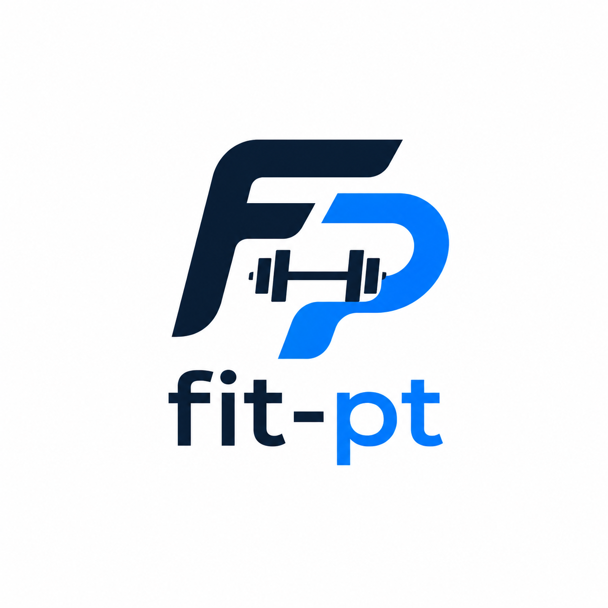
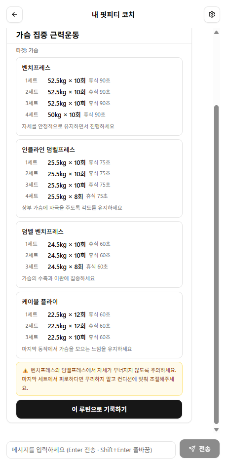
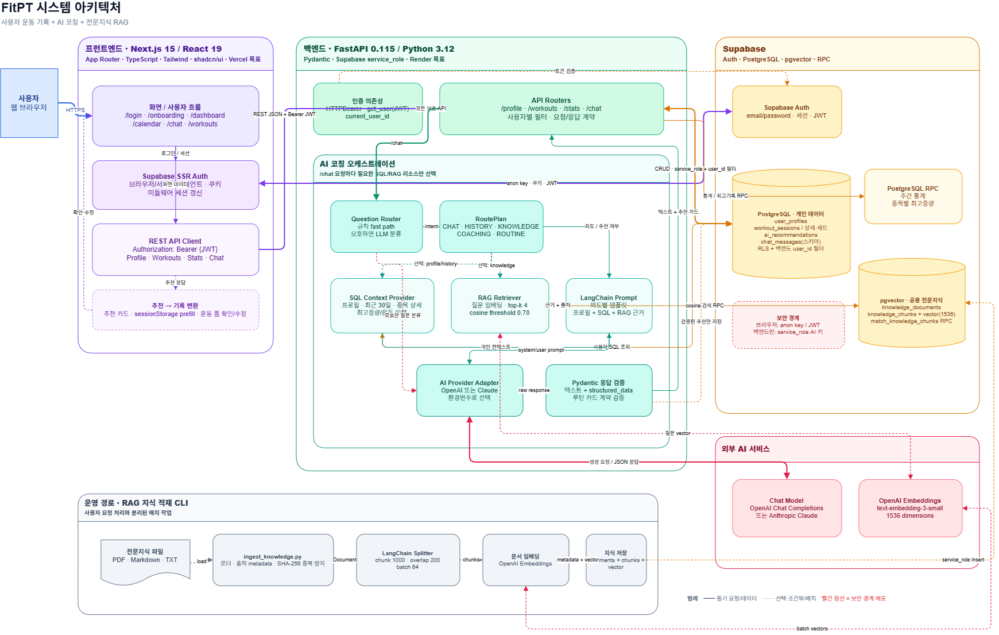
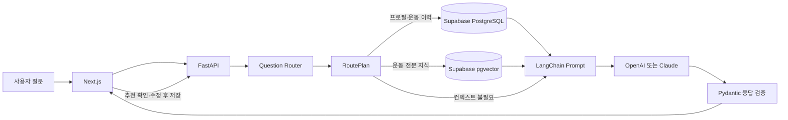

<p align="center">
  
</p>

<h1 align="center">Fit-PT (핏피티)</h1>

<p align="center">
  운동 기록을 체계적으로 관리하고 누적된 기록을 바탕으로 운동 루틴과 상담을 제공해주는 개인화 AI 퍼스널 트레이너
</p>

<p align="center">
  <strong>Next.js / FastAPI / Supabase / LangChain / RAG</strong>
</p>

## 프로젝트 소개

Fit-PT는 사용자의 운동 기록과 목표를 기반으로 개인화된 운동 상담과 루틴을 제공하는 AI 퍼스널 트레이너 웹 서비스입니다.

웨이트의 세트·중량과 러닝의 거리·페이스를 기록하고, 누적된 운동 데이터를 바탕으로 AI 트레이너에게 운동 루틴과 중량 조절 방향을 추천받을 수 있습니다. 운동생리학 및 근비대 연구논문 자료로 RAG 지식베이스를 구축하고 LangChain 기반 검색·응답 파이프라인을 적용해, 일반적인 답변이 아닌 검색된 근거를 활용한 운동 상담을 제공합니다.

AI가 추천한 루틴은 답변으로 끝나지 않습니다. 구조화된 추천 카드를 운동 기록 폼으로 불러와 값을 확인·수정한 뒤 실제 기록으로 저장/관리 할 수 있습니다.

## 핵심 기능

| 기능 | 설명 |
| --- | --- |
| 개인화 AI 코칭 | 운동 목표·숙련도·주의 부위와 실제 운동 이력을 질문에 맞게 조합해 답변합니다. |
| 운동 지식 RAG | 논문·가이드 문서를 임베딩하고 Supabase pgvector로 관련 문단을 검색해 답변 근거로 사용합니다. |
| AI 루틴 추천 | 웨이트·러닝·기타 운동 추천을 타입별 구조화 카드로 제공합니다. |
| 추천에서 기록으로 | AI 추천값을 운동 기록 폼에 자동 입력하고, 사용자가 검토·수정한 뒤 저장합니다. |
| 운동 기록 관리 | 웨이트 세트·중량·횟수, 러닝 거리·시간·페이스, 기타 운동을 기록합니다. |
| 캘린더와 통계 | 월별 기록과 주간 운동 시간·웨이트 볼륨·러닝 거리의 변화를 확인합니다. |

## 화면 미리보기

<table>
  <tr>
    <td align="center" width="50%">
      <br />
      <sub><strong>대시보드</strong> — 운동 프로필과 이번 주 요약을 확인하고, 4주·8주 운동량 추세와 주요 기능으로 바로 이동합니다.</sub>
    </td>
    <td align="center" width="50%">
      <br />
      <sub><strong>운동 캘린더</strong> — 날짜별 기록을 운동 타입 색상으로 구분하고 선택한 날의 웨이트·러닝 기록을 조회합니다.</sub>
    </td>
  </tr>
</table>

<table>
  <tr>
    <td align="center" width="50%">
      <br />
      <sub><strong>RAG 운동 상담</strong> — 질문과 의미가 가까운 운동 지식 문단을 검색하고, 답변에 사용한 근거를 자료 번호와 함께 보여줍니다.</sub>
    </td>
    <td align="center" width="50%">
      <br />
      <sub><strong>AI 루틴 추천</strong> — 최근 운동 기록과 프로필을 바탕으로 종목·세트·중량·횟수·휴식 시간이 포함된 루틴 카드를 생성합니다.</sub>
    </td>
  </tr>
</table>

<table>
  <tr>
    <td align="center" width="50%">
      <br />
      <sub><strong>추천에서 기록으로</strong> — 추천 카드 하단의 <strong>“이 루틴으로 기록하기”</strong> 버튼을 누르면 AI가 만든 루틴을 운동 기록 화면으로 전달합니다.</sub>
    </td>
    <td align="center" width="50%">
      <br />
      <sub><strong>운동 기록 자동 입력</strong> — 전달받은 종목·세트·중량·횟수를 폼에 자동으로 채우고, 실제 수행 내용에 맞게 수정한 뒤 저장합니다.</sub>
    </td>
  </tr>
</table>

## 시스템 아키텍처

<p align="center">
  
</p>

<p align="center">
  <sub><strong>전체 시스템 흐름</strong> — Next.js 프론트엔드, FastAPI의 AI 코칭 오케스트레이션, Supabase 인증·관계형 데이터·pgvector, 외부 AI 모델, 운영자용 RAG 문서 적재 경로의 연결을 나타냅니다. 

- **Next.js 프론트엔드:** Supabase SSR Auth로 로그인 상태를 유지하고, Bearer JWT를 포함해 FastAPI를 호출합니다.
- **FastAPI 백엔드:** 인증된 사용자 ID를 기준으로 API 요청을 처리하고 Question Router와 `RoutePlan`으로 AI 응답에 필요한 리소스를 결정합니다.
- **Supabase:** 사용자·운동 기록은 PostgreSQL에, 공용 운동 전문지식 embedding은 pgvector에 분리해 저장합니다. Auth와 RLS로 사용자 데이터 접근 경계를 구성합니다.
- **AI 서비스:** 채팅 응답은 OpenAI 또는 Claude를 선택할 수 있고, RAG 문서 embedding은 OpenAI `text-embedding-3-small`을 사용합니다.
- **RAG 적재 CLI:** PDF·Markdown·TXT를 서비스 요청과 분리된 운영자 명령으로 로드하고, LangChain Splitter로 나눈 뒤 embedding과 출처 metadata를 함께 저장합니다.

### 질문 처리 흐름



위 흐름도는 전체 시스템 구성 중 사용자의 질문이 AI 답변으로 변환되는 경로만 단순화한 것입니다. 운동 지식 질문에는 pgvector 검색 결과가, 개인화 질문에는 프로필·운동 이력이 LangChain 프롬프트로 합쳐집니다.

현재는 모델이 임의로 도구를 선택하는 Tool Calling 방식 대신, 서버가 실행 경로를 통제하는 구조를 사용합니다.

1. 규칙 기반 fast path와 LLM 의미 분류 fallback을 결합한 Router가 질문 의도를 분류합니다.
2. `RoutePlan`이 프로필, 운동 이력 SQL, RAG, 추천 카드 중 필요한 리소스만 선택합니다.
3. 수치·개인 기록은 PostgreSQL에서, 논문·가이드 같은 비정형 지식은 pgvector에서 검색합니다.
4. LangChain이 검색 결과와 사용자 컨텍스트를 프롬프트에 조합합니다.
5. LLM 응답은 Pydantic 계약을 통과한 경우에만 추천 카드와 기록 폼으로 전달됩니다.

개인 운동 기록은 공용 RAG 저장소에 넣지 않으며, 인증된 사용자의 SQL 컨텍스트로만 사용합니다.

### Intent별 컨텍스트 선택

| 질문 유형 | 프로필 | 운동 이력 SQL | 전문지식 RAG | 추천 카드 |
| --- | :---: | :---: | :---: | :---: |
| 일반 대화 |  |  |  |  |
| 운동 기록 조회 |  | ✓ |  |  |
| 운동 지식 질문 |  |  | ✓ |  |
| 개인화 코칭 | ✓ | ✓ | ✓ |  |
| 루틴 추천 | ✓ | ✓ | ✓ | ✓ |

이 방식은 모든 질문에 전체 기록과 문서를 넣지 않기 때문에 불필요한 DB 조회와 토큰 사용을 줄이고, 어떤 데이터가 프롬프트에 포함되는지 서버 코드에서 추적할 수 있습니다.

## 핵심 구현 내용

### 하이브리드 Question Router

명확한 표현은 규칙 기반 fast path로 빠르게 분류하고, “근성장”, “호르몬 반응”처럼 규칙에 없는 동의어나 문맥형 질문은 LLM 의미 분류 fallback으로 처리합니다. Router는 답변을 생성하지 않고 Intent만 반환하며, 실제 리소스 선택은 `RoutePlan`이 담당합니다.

### SQL 컨텍스트와 RAG의 역할 분리

운동 횟수·중량·거리·최근 기록처럼 정확한 값이 필요한 정보는 SQL로 조회합니다. 반면 논문·가이드·운동 원리처럼 비정형 자료는 embedding 기반 RAG 검색으로 찾습니다. 이를 통해 개인 기록의 수치 정확성과 전문지식의 의미 검색을 각각 알맞은 방식으로 처리합니다.

### 출처를 보존하는 RAG 파이프라인

문서를 chunk로 분할할 때 제목, 출처, 문서 유형, 언어, 카테고리, 페이지 정보를 metadata로 함께 저장합니다. 질문 embedding과 cosine similarity가 임계값 이상인 문단만 프롬프트에 전달하며, 답변에도 검색된 자료 번호를 표시할 수 있게 provenance를 유지합니다.

### 구조화 추천 계약

AI 루틴은 텍스트와 `structured_data`를 함께 반환합니다. 백엔드가 코드 펜스와 중첩 JSON을 복구한 뒤 운동 타입별 Pydantic 스키마로 필수 필드와 값 범위를 검증하므로, 계약을 통과한 추천만 카드와 기록 폼에 전달됩니다.

## 기술적 문제 해결

| 문제 | 해결 | 결과 |
| --- | --- | --- |
| 규칙 Router가 동의어·문맥형 운동 질문을 놓침 | 규칙 fast path 뒤에 LLM 의미 분류 fallback 추가 | 키워드를 계속 나열하지 않아도 RAG가 필요한 질문을 의미 기반으로 분류 |
| 검색 결과가 없거나 관련 없는 chunk가 섞임 | 같은 embedding 모델·1536차원 유지, cosine 임계값과 `top_k` 설정, 검색 CLI로 단계별 점검 | 적재·검색·라우팅·웹 응답 중 실패 지점을 분리해 확인 가능 |
| LLM별 JSON 응답 형식이 일정하지 않음 | 공통 Provider 인터페이스, JSON 복구 파서, Pydantic 추천 스키마 적용 | 검증된 데이터만 추천 카드로 렌더링하고 실패 시 안전하게 텍스트로 축소 |
| AI 추천을 사용자가 다시 입력해야 함 | 구조화 추천을 `sessionStorage`로 일회성 전달하고 폼 초기값으로 변환 | “이 루틴으로 기록하기” 버튼 한 번으로 추천과 실제 기록 흐름을 연결 |
| 전체 운동 이력을 프롬프트에 넣으면 컨텍스트가 커짐 | 기간·최고 기록·운동 부위 의도에 맞는 SQL 데이터만 선택 조회 | 질문과 관련된 사용자 기록만 AI 컨텍스트에 포함 |

## 기술 스택

| 영역 | 기술 |
| --- | --- |
| Frontend | Next.js 15, React 19, TypeScript, Tailwind CSS, shadcn/ui |
| Backend | Python 3.12, FastAPI, Pydantic |
| Database / Auth | Supabase PostgreSQL, Auth, RLS |
| AI | OpenAI 또는 Claude, LangChain |
| RAG | OpenAI Embeddings, Supabase pgvector |
| Test | Python unittest, TypeScript compiler |

## 프로젝트 구조

```text
fit-pt/
├── apps/
│   ├── web/
│   │   ├── app/                   # App Router 화면과 경로
│   │   ├── components/            # 추천 카드와 공통 UI
│   │   ├── lib/                   # API·인증·Supabase·폼 전달 로직
│   │   └── types/                 # 운동·추천·API 타입 계약
│   └── api/
│       ├── app/
│       │   ├── core/              # 환경 설정과 인증 의존성
│       │   ├── routers/           # Profile·Workout·Chat·Stats API
│       │   ├── schemas/           # Pydantic 요청 모델
│       │   └── services/
│       │       ├── ai/            # Router·Orchestrator·Prompt·응답 검증
│       │       ├── rag/           # 문서 적재와 pgvector Retriever
│       │       └── context.py     # 질문별 사용자 SQL 컨텍스트
│       ├── scripts/               # 지식 적재·검색·질문 분류 CLI
│       └── tests/                 # AI·RAG 단위 및 통합 테스트
├── docs/                           # API·DB·AI/RAG 운영 문서
└── supabase/migrations/            # 스키마·RLS·RPC 변경 이력
```

## 주요 API

`/health`를 제외한 제품 API는 Supabase 액세스 토큰을 `Authorization: Bearer <token>` 헤더로 전달합니다.

| Method | Endpoint | 역할 |
| --- | --- | --- |
| `GET` / `PUT` | `/profile` | 현재 사용자의 운동 프로필 조회·저장 |
| `GET` | `/workouts` | 전체 또는 연·월별 운동 기록 조회 |
| `GET` / `PUT` / `DELETE` | `/workouts/{session_id}` | 운동 상세 조회·공통 정보 수정·삭제 |
| `POST` | `/workouts/weight` | 웨이트 종목과 세트 기록 생성 |
| `POST` | `/workouts/running` | 러닝 기록 생성과 평균 페이스 계산 |
| `POST` | `/workouts/other` | 기타 운동 기록 생성 |
| `POST` | `/chat` | 질문 분류 후 선택적 SQL/RAG 코칭 응답 생성 |
| `GET` | `/stats/summary` | 이번 주 시간·전체 횟수·최근 운동일 조회 |
| `GET` | `/stats/weekly?weeks=4` | 4주 또는 8주 운동 추세 조회 |

## 빠른 시작

### 1. 저장소와 환경 파일 준비

```powershell
git clone https://github.com/kwonup/fit-pt.git
cd fit-pt
Copy-Item apps/web/.env.local.example apps/web/.env.local
Copy-Item apps/api/.env.example apps/api/.env
```

두 환경 파일에 Supabase와 사용할 AI 공급자의 키를 입력합니다. 서버 전용 `SUPABASE_SERVICE_ROLE_KEY`와 AI API 키는 브라우저용 환경 파일이나 Git에 포함하지 마세요.

### 2. 데이터베이스 준비

Supabase SQL Editor에서 [`supabase/migrations`](./supabase/migrations)의 `001_initial_schema.sql`부터 `007_knowledge_rag.sql`까지 번호순으로 실행합니다. RAG 문서 적재 방법은 [RAG 적재 가이드](./docs/rag-ingestion.md)를 참고하세요.

### 3. 백엔드 실행

```powershell
cd apps/api
python -m venv .venv
.\.venv\Scripts\Activate.ps1
python -m pip install -r requirements.txt
python -m uvicorn app.main:app --reload
```

- API: `http://localhost:8000`
- Swagger UI: `http://localhost:8000/docs`

### 4. 프론트엔드 실행

새 터미널에서 다음 명령을 실행합니다.

```powershell
cd apps/web
npm ci
npm run dev
```

- Web: `http://localhost:3000`

### 5. 검증

```powershell
# apps/api
python -m unittest discover -s tests -v

# apps/web
npm exec tsc -- --noEmit --incremental false
```

## 문서

| 문서 | 내용 |
| --- | --- |
| [AI·RAG 운영 가이드](./docs/ai-rag-operations.md) | 질문 분류부터 웹 응답까지의 흐름과 점검 방법 |
| [RAG 문서 적재 가이드](./docs/rag-ingestion.md) | PDF·Markdown 적재, 검색 확인, 재적재 방법 |
| [API 명세](./docs/api-spec.md) | 엔드포인트, 인증, 요청·응답 계약 |
| [DB 설계](./docs/db-schema.md) | 테이블, 관계, RLS, 함수, 벡터 검색 구조 |
| [프로젝트 계획](./docs/project-plan.md) | 구현 범위, 아키텍처와 후속 과제 |

## 프로젝트 정보

| 항목 | 내용 |
| --- | --- |
| 개발 기간 | 2026.06 ~ 2026.08 |
| 팀 구성 | 개인 프로젝트 |
| 담당 범위 | 서비스 기획, UI 설계, 프론트엔드·백엔드 개발, DB 설계, AI·RAG 구현 |
| 저장소 | [github.com/kwonup/fit-pt](https://github.com/kwonup/fit-pt) |

