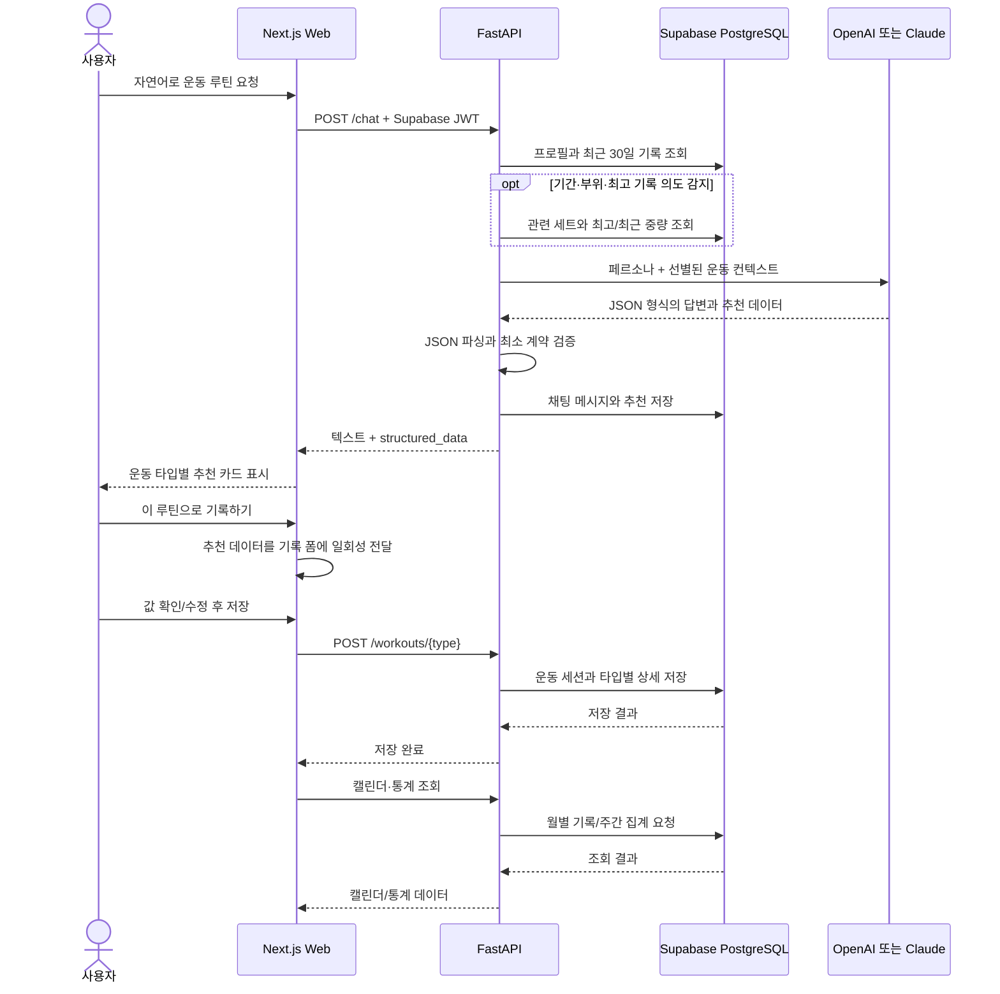
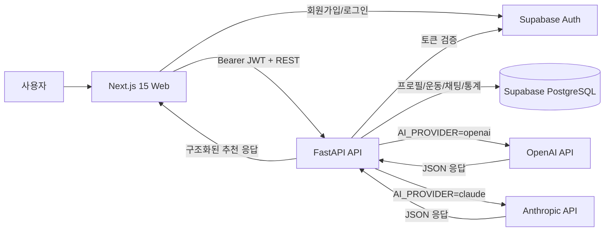
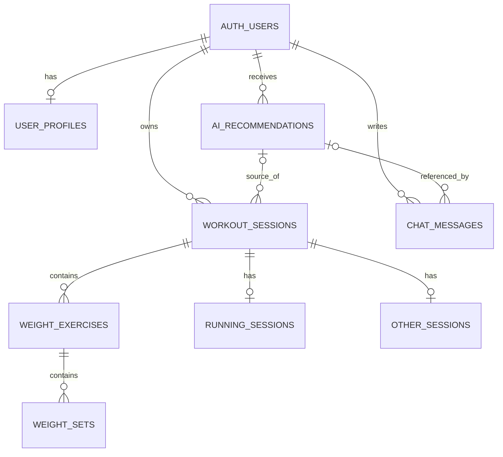

# Fit PT (핏피티)

> 웨이트/러닝 운동 기록을 체계적으로 관리하고 누적된 기록을 바탕으로 나만의 AI 코치에게 운동 루틴과 상담을 제공받을 수 있는 개인화 운동 관리 서비스

Fit-PT는 사용자의 웨이트/러닝 기록을 지속적으로 아카이빙하여 운동량과 수행 변화를 확인하고 점진적 과부하를 체계적으로 적용할 수 있도록 돕습니다. 누적된 운동 기록과 사용자 프로필은 AI 코치의 상담 데이터로 활용되며 사용자는 자신의 운동 수준과 목표에 맞는 루틴을 추천받거나 운동과 관련된 질문을 자유롭게 상담할 수 있습니다.

AI 코치가 생성한 루틴은 답변으로 끝나지 않고 실제 운동 기록 폼으로 불러올 수 있습니다. 사용자는 추천받은 종목, 세트, 중량, 횟수, 거리 등의 내용을 확인하고 필요에 맞게 수정한 뒤 자신의 운동 기록으로 저장할 수 있습니다.

## 목차

- [프로젝트 소개](#프로젝트-소개)
- [프로젝트 링크](#프로젝트-링크)
- [개발 정보](#개발-정보)
- [현재 구현 범위](#현재-구현-범위)
- [주요 기능](#주요-기능)
- [핵심 사용자 흐름](#핵심-사용자-흐름)
- [기술 스택](#기술-스택)
- [시스템 아키텍처](#시스템-아키텍처)
- [주요 구현 내용](#주요-구현-내용)
- [기술적 문제 해결](#기술적-문제-해결)
- [데이터베이스](#데이터베이스)
- [주요 API](#주요-api)
- [프로젝트 구조](#프로젝트-구조)
- [로컬 실행](#로컬-실행)
- [환경 변수](#환경-변수)
- [검증 및 코드 품질](#검증-및-코드-품질)
- [현재 한계와 개선 계획](#현재-한계와-개선-계획)
- [프로젝트 회고](#프로젝트-회고)

## 프로젝트 소개

일반적인 운동 기록 서비스는 이미 수행한 운동을 저장하는 데 집중하고 AI 피트니스 서비스의 추천은 텍스트 답변으로 끝나는 경우가 많습니다. 이때 사용자는 추천 내용을 기억하거나 기록 화면에 다시 입력해야 합니다.

핏피티는 이 단절을 해결하기 위해 다음 흐름을 하나의 서비스 안에 연결했습니다.

1. 사용자의 목표, 숙련도, 주의 부위와 과거 운동 기록을 조회합니다.
2. 질문 의도에 맞는 기록만 선별해 AI 컨텍스트를 구성합니다.
3. AI 응답을 웨이트·러닝·기타 운동별 구조화 데이터로 변환합니다.
4. 추천 카드를 기록 폼의 초기값으로 옮겨 사용자가 검토/수정한 뒤 저장하게 합니다.
5. 저장된 기록을 월간 캘린더와 주간 통계에 반영합니다.

## 프로젝트 링크

| 구분 | 링크 |
| --- | --- |
| GitHub 저장소 | [kwonup/fit-pt](https://github.com/kwonup/fit-pt) |
| 프론트엔드 코드 | [`apps/web`](./apps/web) |
| 백엔드 코드 | [`apps/api`](./apps/api) |
| API 명세 | [`docs/api-spec.md`](./docs/api-spec.md) |
| DB 설계 | [`docs/db-schema.md`](./docs/db-schema.md) |
| 로컬 Swagger UI | `http://localhost:8000/docs` |
| 배포 서비스 | `[링크 추가 필요]` |
| 시연 영상 | `[링크 추가 필요]` |

> **대표 화면:** 현재 저장소에는 서비스 스크린샷이나 데모 GIF가 없습니다. `[이미지 추가 필요]`

## 개발 정보

| 항목 | 내용 |
| --- | --- |
| 개발 기간 | `2026.06 ~ 2026.07`|
| 팀 구성 | `개인 프로젝트` |
| 담당 범위 | `서비스 기획, UI 설계, 프론트엔드·백엔드 개발, DB 설계, AI 기능 구현` |

## 현재 구현 범위

| 영역 | 상태 | 현재 범위 |
| --- | --- | --- |
| 이메일 인증과 접근 제어 | 구현 | Supabase 회원가입·로그인, SSR 세션 갱신, 보호 경로 리다이렉트 |
| 운동 프로필과 AI 페르소나 | 구현 | 목표·숙련도·주 운동·빈도·주의 부위, 천사/호랑이 코치 설정 |
| 운동 기록 | 부분 구현 | 웨이트·러닝·기타 생성, 월별 조회, 상세 조회, 삭제. 공통 필드 수정 API는 있으나 수정 UI는 없음 |
| AI 코칭 | 구현 | OpenAI/Claude 선택, 프로필·운동 이력 기반 답변, 구조화 추천 카드 |
| 추천을 기록으로 전환 | 구현 | 추천 데이터를 일회성으로 기록 폼에 채우고 수정 후 저장 |
| 운동 통계 | 구현 | 요약 지표와 4주/8주 운동 시간·웨이트 볼륨·러닝 거리 |
| 채팅 이력 | 부분 구현 | DB 저장은 구현, 이전 대화 조회 API와 UI는 없음 |
| 배포·테스트 자동화 | 미구현 | 실서비스 URL, CI/CD, 프로젝트 소유 자동화 테스트 없음 |

## 주요 기능

### 1. 인증과 맞춤형 온보딩

- 이메일과 비밀번호로 가입·로그인하고, 미인증 상태에서는 핵심 화면에 접근할 수 없습니다.
- 최초 사용자는 운동 목표, 숙련도, 주 운동 타입, 주당 빈도, 주의 부위와 코치 페르소나를 설정합니다.
- 프로필이 없는 사용자가 대시보드에 진입하면 온보딩 화면으로 이동합니다.

### 2. 운동 이력을 활용하는 AI 코치

- 사용자는 “2주 전 등 운동과 비슷하게”, “최고 기록을 참고해 가슴 루틴을 짜줘”처럼 자연어로 요청할 수 있습니다.
- 백엔드는 기본 프로필과 최근 30일 요약에 더해, 질문에서 기간·최고 기록·운동 부위 의도를 감지했을 때 관련 세트 기록을 추가 조회합니다.
- 사용자가 선택한 상냥한 천사 코치(`angel`) 또는 엄격한 호랑이 코치(`tiger`)의 말투를 시스템 프롬프트에 반영합니다.

### 3. 구조화 추천 카드와 기록 폼 자동 채움

- AI 추천을 웨이트·러닝·기타 운동별 카드로 렌더링합니다.
- `이 루틴으로 기록하기`를 누르면 종목, 세트, 중량, 횟수 또는 거리, 시간, 페이스가 기록 폼에 자동 입력됩니다.
- 사용자는 추천을 그대로 저장하지 않고 제목·세부 값·메모를 확인하고 수정한 뒤 기록할 수 있습니다.

### 4. 세 가지 운동 기록과 월간 캘린더

- 웨이트는 여러 종목과 세트별 중량·횟수를, 러닝은 거리,시간,페이스,강도를 기록합니다.
- 클라이밍이나 스트레칭처럼 정형화하기 어려운 운동은 `기타` 타입으로 자유롭게 기록합니다.
- 월간 캘린더는 날짜별 기록을 웨이트,러닝,기타 색상으로 구분하고 상세 화면과 삭제 흐름을 제공합니다.

### 5. 운동 추세 대시보드

- 이번 주 운동 시간, 전체 운동 횟수, 최근 운동일을 요약합니다.
- 4주 또는 8주 단위로 운동 시간, 웨이트 볼륨(`중량 × 횟수`), 러닝 거리를 전환해 확인할 수 있습니다.
- PostgreSQL 집계 함수가 기록이 없는 주도 `0`으로 채워 연속된 시계열을 반환합니다.

## 핵심 사용자 흐름



## 기술 스택

| 영역 | 기술 | 사용 목적 |
| --- | --- | --- |
| Frontend | **Next.js 15 (`^15.3.0`) / React 19** | App Router 기반 화면 구성과 라우팅, 인증 미들웨어 처리 |
| Frontend | **TypeScript 5** | 운동 타입·추천 데이터·API 응답을 판별 가능한 타입으로 관리 |
| Frontend | **Tailwind CSS 3.4 / shadcn/ui / Base UI** | 반응형 레이아웃과 재사용 가능한 UI 컴포넌트 구성 |
| Backend | **Python 3.12 / FastAPI 0.115 / Uvicorn** | 인증된 REST API, 요청 검증, OpenAPI 문서 제공 |
| Backend | **Pydantic / Pydantic Settings 2.5** | 요청 스키마의 타입·범위 검증과 환경 변수 로딩 |
| Database / Auth | **Supabase PostgreSQL / Auth / RLS** | 이메일 인증, 관계형 운동 데이터 저장, 사용자별 접근 정책 적용 |
| Database | **PostgreSQL Functions** | 최고·최근 중량과 주간 시간·볼륨·거리 집계를 DB에서 처리 |
| AI | **OpenAI SDK 1.54 / Anthropic SDK 0.40** | 환경 변수로 선택 가능한 AI 코치 응답 생성 |
| Development | **npm / pip / Git / Swagger UI** | 잠금 파일 기반 프론트 설치, Python 의존성 관리, API 확인 |

> Vercel과 Render는 문서에 정의된 **배포 대상**이며, 현재 저장소에서 실제 배포 URL이나 배포 설정 파일은 확인되지 않습니다.

## 시스템 아키텍처



- 프론트엔드는 Supabase를 인증에 사용하고, 프로필·운동·통계 같은 업무 데이터는 FastAPI를 통해 처리합니다.
- FastAPI는 전달받은 토큰을 Supabase Auth로 검증한 뒤 사용자 ID를 추출합니다.
- 백엔드는 `service_role` 키를 사용하므로 최상위 사용자 데이터는 인증된 `id` 또는 `user_id`로 필터링하고, 타입별 상세는 본인 세션의 소유권을 확인한 뒤 조회합니다. DB에는 각 업무 테이블의 RLS 정책도 정의했습니다.
- AI 라우터는 특정 공급자 구현에 직접 의존하지 않고 공통 인터페이스와 팩토리를 통해 OpenAI 또는 Claude를 선택합니다.

## 주요 구현 내용

- **인증 경계:** Next.js 미들웨어에서 세션 쿠키를 갱신하고 보호 경로를 제어하며, FastAPI는 Bearer 토큰을 다시 검증합니다.
- **도메인 모델링:** 공통 `workout_sessions` 아래에 웨이트·러닝·기타 상세 테이블을 분리해 타입별 속성과 공통 통계를 함께 다룹니다.
- **입력 검증:** Pydantic 모델로 제목, 운동 시간, 거리, 빈도 등의 필수 여부와 범위를 검증하고 러닝 페이스를 서버에서 자동 계산합니다.
- **실패 보상:** 운동 세션 생성 뒤 하위 데이터 저장이 실패하면 사용자 조건으로 부모 세션 삭제를 시도해 cascade 정리합니다. 완전한 DB 트랜잭션 대신 부분 저장 가능성을 줄이기 위한 보상 처리입니다.
- **통계 집계:** `generate_series`를 이용한 SQL 함수가 빈 주를 포함한 4주/8주 데이터를 만들고 시간·볼륨·거리를 한 번의 RPC로 반환합니다.

## 기술적 문제 해결

### 1. 서로 다른 LLM 응답을 기록 가능한 데이터로 안전하게 변환

#### 문제 상황

AI 추천을 기록 폼에 자동 입력하려면 항상 파싱 가능한 JSON이 필요하지만, 모델은 코드 펜스나 설명문을 붙이거나 JSON을 문자열 안에 다시 넣는 등 응답 형식을 다르게 만들 수 있습니다.

#### 원인

OpenAI는 JSON 응답 모드를 지원하지만 Claude 연동은 프롬프트 계약에 의존하며, 같은 공급자에서도 생성 결과가 완전히 동일하다고 보장할 수 없습니다.

#### 해결

- 공통 `AIProvider` 인터페이스와 팩토리로 공급자 차이를 라우터 밖으로 분리했습니다.
- 시스템 프롬프트에 운동 타입별 JSON 계약을 정의했습니다.
- 파서에서 코드 펜스 제거, 첫 JSON 객체 탐색, 중첩 JSON과 문자열형 `structured_data` 복구를 순서대로 시도합니다.
- 마지막에는 `workout_type`과 `structured_data.type`의 일치 여부를 확인하고, 최소 계약을 충족하지 못하면 추천 데이터를 버립니다.
- 프론트엔드에서도 JSON 형태의 응답을 다시 파싱하고 일부 중첩 응답 복구를 시도합니다.

#### 결과

JSON으로 복구되고 최소 타입 계약을 통과한 응답만 추천 카드와 기록 폼으로 전달하고, 복구할 수 없는 경우에는 텍스트 안내로 축소합니다. 성능 수치는 별도로 측정하지 않았습니다.

### 2. 전체 이력을 보내지 않고 질문에 필요한 기록만 AI 컨텍스트로 구성

#### 문제 상황

최근 운동 횟수만으로는 “지난번처럼”, “2주 전과 비슷하게”, “최고 기록을 참고해서” 같은 요청에 필요한 세트·중량·횟수를 알 수 없습니다. 반대로 전체 기록을 매번 프롬프트에 넣으면 관련 없는 정보가 늘어납니다.

#### 원인

운동 기록은 날짜·종목·세트로 구조화되어 있지만 사용자 질문은 자연어이므로, 질문 의도와 필요한 정형 데이터를 연결하는 계층이 필요했습니다.

#### 해결

- 기본 컨텍스트는 프로필과 최근 30일 운동 요약으로 제한했습니다.
- 기간 표현, 최근/동일 요청, 최고 기록, 운동 부위 키워드를 감지했을 때만 상세를 추가 조회합니다. 최근 기록은 90일 범위를 사용하고, 특정 시점 요청은 해당 날짜에 가까운 세션을 우선합니다.
- PostgreSQL 함수에서 운동명을 정규화한 뒤 종목별 역대 최고 세트와 최근 작업 세트를 집계하고 결과 수를 제한했습니다.
- 프롬프트에는 최근 중량을 기준으로 소폭 증량하고 최고 중량을 크게 넘지 않도록 하는 안전 규칙을 추가했습니다.

#### 결과

질문의 종류에 따라 필요한 과거 기록을 선택적으로 제공하는 경로를 만들었습니다. 토큰이나 응답 품질의 정량 지표는 아직 측정하지 않았습니다.

### 3. AI 추천과 실제 운동 기록 사이의 재입력 제거

#### 문제 상황

텍스트로 받은 운동 루틴을 사용자가 기록 화면에 다시 입력하면 추천과 기록이 분리되고, 종목과 세트가 많을수록 입력 부담이 커집니다.

#### 원인

AI 출력 형식과 서비스의 웨이트·러닝·기타 기록 입력 형식 사이에 명시적인 데이터 매핑이 없었습니다.

#### 해결

- 추천 데이터를 TypeScript 판별 유니온으로 정의하고 운동 타입별 카드로 렌더링했습니다.
- 카드에서 기록 화면으로 이동할 때 `sessionStorage`에 구조화 데이터만 저장합니다.
- 기록 화면은 데이터를 읽는 즉시 삭제해 새로고침 시 중복 적용을 막고, 타입별 폼 필드로 변환합니다.
- 자동 입력 뒤에도 사용자가 폼에 매핑된 값을 검토하고 수정한 후 기존 운동 생성 API로 저장하게 했습니다.

#### 결과

추천 내용을 수동으로 다시 입력하지 않고 실제 운동 기록으로 전환할 수 있는 핵심 사용자 흐름을 구현했습니다. 현재 추천 ID와 저장된 기록의 연결은 남은 과제입니다.

## 데이터베이스

| 테이블 | 역할 |
| --- | --- |
| `auth.users` | Supabase가 관리하는 인증 사용자 |
| `user_profiles` | 목표, 숙련도, 주의 부위, 코치 페르소나 |
| `workout_sessions` | 날짜, 타입, 제목, 시간 등 운동 공통 정보 |
| `weight_exercises` / `weight_sets` | 웨이트 종목과 세트별 중량·횟수 |
| `running_sessions` | 러닝 거리, 시간, 평균 페이스, 강도 |
| `other_sessions` | 기타 운동의 자유 서술 내용 |
| `ai_recommendations` | AI 답변과 구조화 추천 JSONB |
| `chat_messages` | 사용자와 AI의 메시지 이력 |



스키마에는 외래 키와 `ON DELETE CASCADE`, 사용자·날짜 및 정렬 기준 인덱스, 8개 업무 테이블의 RLS 정책이 포함됩니다. AI 추천 이력은 `structured_data` JSONB로 저장하고, 현재 폼 전환은 `/chat` 응답의 구조 데이터를 `sessionStorage`로 전달합니다. 운동 기록은 조회와 집계가 쉬운 관계형 테이블로 분리했습니다.

## 주요 API

`/health`를 제외한 제품 API는 Supabase 액세스 토큰을 `Authorization: Bearer <token>` 헤더로 전달해야 합니다. 실행 후 Swagger UI(`/docs`)와 ReDoc(`/redoc`)에서 전체 스키마를 확인할 수 있습니다.

| Method | Endpoint | 설명 | 인증 |
| --- | --- | --- | --- |
| `GET` | `/health` | 서버 상태 확인 | 불필요 |
| `GET` | `/profile` | 현재 사용자 프로필 조회 | 필요 |
| `PUT` | `/profile` | 프로필 필드 upsert | 필요 |
| `GET` | `/workouts` | 전체 또는 연·월별 기록 조회. `year`, `month`는 함께 전달 | 필요 |
| `GET` | `/workouts/{session_id}` | 운동 타입별 상세 조회 | 필요 |
| `POST` | `/workouts/weight` | 웨이트 기록 생성 | 필요 |
| `POST` | `/workouts/running` | 러닝 기록 생성, 페이스 미입력 시 자동 계산 | 필요 |
| `POST` | `/workouts/other` | 기타 운동 기록 생성 | 필요 |
| `PUT` | `/workouts/{session_id}` | 날짜·제목·시간·메모 수정 | 필요 |
| `DELETE` | `/workouts/{session_id}` | 본인 운동 기록 삭제 | 필요 |
| `POST` | `/chat` | AI 답변과 선택적 추천 생성·저장 | 필요 |
| `GET` | `/stats/weekly?weeks=4` | 4주 또는 8주 시간·볼륨·거리 조회 | 필요 |
| `GET` | `/stats/summary` | 이번 주 시간·전체 횟수·최근 운동일 조회 | 필요 |

## 프로젝트 구조

```text
fit-pt/
├── apps/
│   ├── web/
│   │   ├── app/                 # App Router 화면과 경로
│   │   ├── components/          # 추천 카드와 공통 UI
│   │   ├── lib/                 # API, 인증, Supabase, 폼 전달 로직
│   │   └── types/               # 운동·추천·API 타입 계약
│   └── api/
│       └── app/
│           ├── core/            # 환경 설정과 인증 의존성
│           ├── routers/         # profile, workouts, chat, stats API
│           ├── schemas/         # Pydantic 요청 모델
│           └── services/
│               ├── ai/          # 공급자, 프롬프트, 응답 파서
│               └── context.py   # 질문별 운동 기록 컨텍스트 구성
├── supabase/
│   └── migrations/              # 스키마, RLS, 집계 함수 변경 이력
└── docs/                         # 프로젝트 계획, API, DB 문서
```

프론트엔드와 백엔드를 `apps` 아래에 분리해 각 애플리케이션의 의존성과 실행 경계를 명확히 했습니다. 데이터 구조와 집계 로직은 번호가 붙은 SQL 마이그레이션으로 버전 관리합니다.

## 로컬 실행

### 사전 준비

- Git
- Node.js 20+ 권장, npm
- Python 3.12+ 권장
- Supabase 프로젝트
- OpenAI 또는 Anthropic API 키

> Node.js와 Python 버전을 강제하는 파일은 아직 없으므로, 위 버전은 현재 프로젝트 문서와 개발 환경 기준의 권장값입니다.

### 1. 저장소 복제

```bash
git clone https://github.com/kwonup/fit-pt.git
cd fit-pt
```

### 2. 환경 파일 생성

macOS/Linux:

```bash
cp apps/web/.env.local.example apps/web/.env.local
cp apps/api/.env.example apps/api/.env
```

Windows PowerShell:

```powershell
Copy-Item apps/web/.env.local.example apps/web/.env.local
Copy-Item apps/api/.env.example apps/api/.env
```

생성한 파일에 자신의 Supabase 정보와 선택한 AI 공급자의 키를 입력합니다. `SUPABASE_SERVICE_ROLE_KEY`와 AI API 키를 프론트엔드 환경 파일에 넣거나 Git에 커밋하지 마세요.

### 3. 데이터베이스 초기화

Supabase Dashboard의 SQL Editor에서 [`supabase/migrations`](./supabase/migrations)의 `001_initial_schema.sql`부터 `007_knowledge_rag.sql`까지 번호순으로 실행합니다.

현재 저장소에는 Supabase CLI용 `supabase/config.toml`이 없으므로, 별도의 `supabase init`, 로그인, 프로젝트 연결 없이 `supabase db push`만 실행하는 방식은 사용할 수 없습니다.

### 4. 백엔드 실행

```bash
cd apps/api
python -m venv .venv
```

macOS/Linux:

```bash
source .venv/bin/activate
```

Windows PowerShell:

```powershell
.\.venv\Scripts\Activate.ps1
```

의존성을 설치하고 서버를 실행합니다.

```bash
python -m pip install -r requirements.txt
python -m uvicorn app.main:app --reload
```

- API: `http://localhost:8000`
- Swagger UI: `http://localhost:8000/docs`
- Health Check: `http://localhost:8000/health`

### 5. 프론트엔드 실행

새 터미널에서 저장소의 `apps/web` 디렉터리로 이동합니다.

```bash
cd apps/web
npm ci
npm run dev
```

- Web: `http://localhost:3000`

프로덕션 빌드 명령은 다음과 같습니다.

```bash
npm run build
npm run start
```

## 환경 변수

### Frontend — `apps/web/.env.local`

| 변수명 | 설명 | 필수 여부 |
| --- | --- | --- |
| `NEXT_PUBLIC_SUPABASE_URL` | 브라우저용 Supabase 프로젝트 URL | 필수 |
| `NEXT_PUBLIC_SUPABASE_ANON_KEY` | 브라우저에서 사용하는 Supabase anon key | 필수 |
| `NEXT_PUBLIC_API_BASE_URL` | FastAPI 주소. 로컬 기본값은 `http://localhost:8000` | 운영 환경 필수 |

### Backend — `apps/api/.env`

| 변수명 | 설명 | 필수 여부 |
| --- | --- | --- |
| `SUPABASE_URL` | Supabase 프로젝트 URL | 필수 |
| `SUPABASE_ANON_KEY` | 백엔드 설정 모델이 로드하는 Supabase anon key | 필수 |
| `SUPABASE_SERVICE_ROLE_KEY` | 서버 전용 DB 접근 키. 프론트 노출 금지 | 필수 |
| `AI_PROVIDER` | 사용할 공급자: `openai` 또는 `claude` | 선택, 기본 `openai` |
| `AI_MAX_TOKENS` | AI 응답 최대 토큰 수 | 선택, 기본 `4096` |
| `OPENAI_API_KEY` | OpenAI 채팅·RAG embedding 인증 키 | OpenAI 채팅 또는 RAG 사용 시 필수 |
| `OPENAI_MODEL` | 사용할 OpenAI 모델명 | 선택 |
| `ANTHROPIC_API_KEY` | Anthropic 인증 키 | Claude 선택 시 필수 |
| `CLAUDE_MODEL` | 사용할 Claude 모델명 | 선택 |
| `EMBEDDING_PROVIDER` | RAG embedding 공급자. 현재 `openai` 고정 | 선택, 기본 `openai` |
| `OPENAI_EMBEDDING_MODEL` | RAG embedding 모델. 현재 `text-embedding-3-small` 고정 | 선택 |
| `EMBEDDING_DIMENSIONS` | DB vector와 동일해야 하는 embedding 차원. 현재 `1536` 고정 | 선택 |
| `RAG_TOP_K` | 질문당 검색할 최대 chunk 수 | 선택, 기본 `4` |
| `RAG_MATCH_THRESHOLD` | cosine similarity 최소 기준 | 선택, 기본 `0.70` |
| `FRONTEND_ORIGIN` | CORS를 허용할 프론트엔드 Origin | 선택, 기본 `http://localhost:3000` |

## 검증 및 코드 품질

| 항목 | 현재 상태 |
| --- | --- |
| TypeScript | `strict: true`, `npm exec tsc -- --noEmit --incremental false` 통과 |
| Python 구문 | 애플리케이션 Python 파일 AST 파싱 통과 |
| Python 의존성 | 로컬 Python 3.12 환경에서 `pip check` 통과 |
| API 스모크 테스트 | FastAPI TestClient로 `GET /health` 응답 `200` 확인 |
| 요청 검증 | Pydantic 스키마로 필수값과 숫자 범위 검증 |
| Lint | `lint` 스크립트는 있으나 ESLint 설정 파일이 없어 현재 비대화형 실행 불가 |
| 자동화 테스트 | 단위·통합·E2E 테스트 미구성 |
| CI/CD | GitHub Actions 등 자동화 설정 미구성 |

현재 자동화 테스트가 없으므로 위 결과는 이번 저장소 분석에서 수행한 정적 검사와 스모크 테스트이며, 회귀 테스트 체계를 의미하지 않습니다.

## 현재 한계와 개선 계획

코드와 설정에서 확인한 후속 과제입니다.

- **기록 전체 수정:** 현재 웹에서는 상세 조회와 삭제만 가능하고, `PUT /workouts/{id}`도 공통 필드만 수정합니다. 웨이트 종목·세트와 러닝 상세 수정 UI/API가 필요합니다.
- **추천 전환 추적:** DB와 생성 스키마에는 `ai_recommendation_id`가 있지만 프론트엔드가 추천 ID를 기록 요청에 전달하지 않습니다. 이를 연결해 추천이 실제 기록으로 전환됐는지 추적할 수 있어야 합니다.
- **채팅 이력 조회:** 메시지와 추천은 저장되지만 `GET` API와 재접속 시 대화를 복원하는 UI가 없습니다.
- **추천 스키마 강화:** 현재 파서는 JSON 여부와 운동 타입 일치를 중심으로 확인합니다. 타입별 필수 필드 전체를 검증하는 Pydantic/JSON Schema 계층을 추가할 수 있습니다.
- **입력 규칙 보완:** 미래 날짜 기록 제한과 추천 폼의 임시저장·복구가 구현되어 있지 않습니다.
- **품질 자동화:** 단위·API 통합·E2E 테스트, ESLint 설정, CI 파이프라인을 추가해야 합니다.
- **배포와 문서 동기화:** Vercel/Render 배포 설정, 라이브 URL, 대표 이미지 또는 데모 GIF를 추가하고 오래된 프로젝트 체크리스트를 현재 구현 상태와 맞춰야 합니다.

## 프로젝트 회고

- **프로젝트를 통해 배운 점:** `[작성 필요]`
- **설계 과정에서 가장 고민한 부분:** `[작성 필요]`
- **구현 과정에서 가장 어려웠던 부분:** `[작성 필요]`
- **다시 개발한다면 개선할 부분:** `[작성 필요]`
