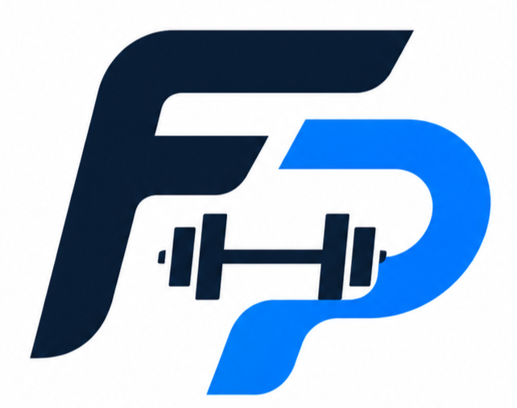
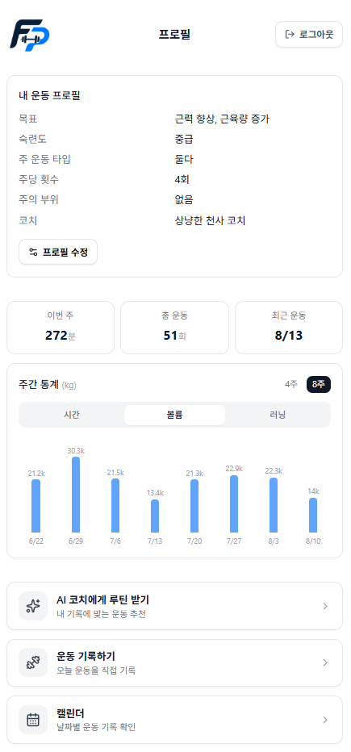
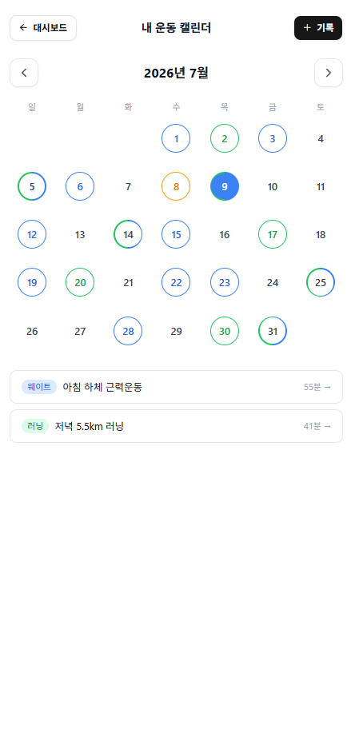
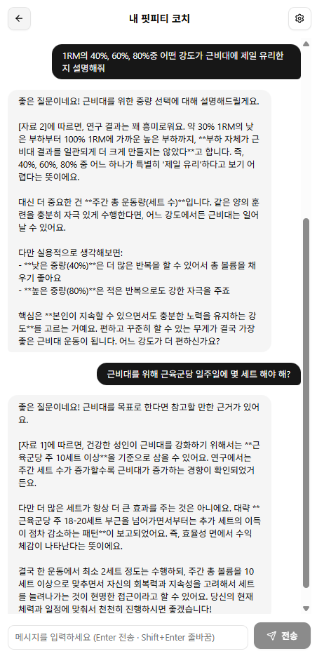
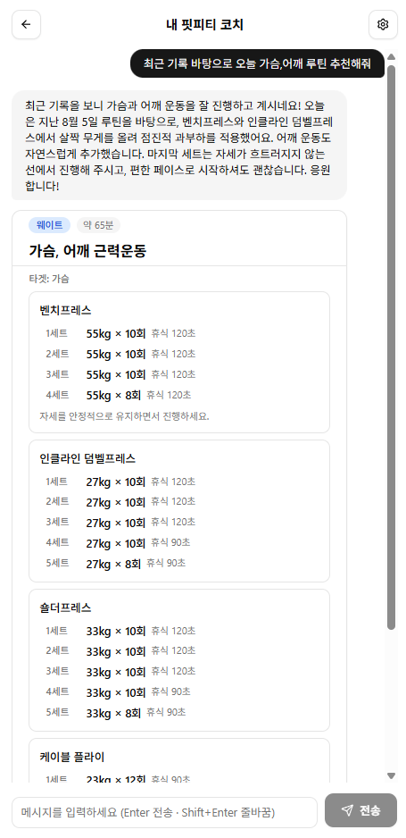
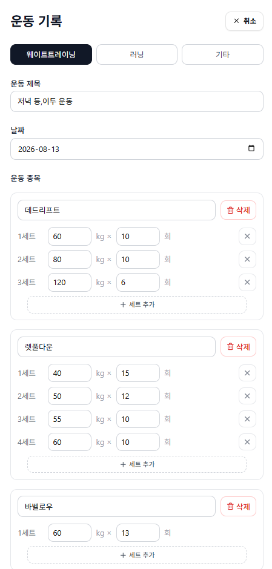
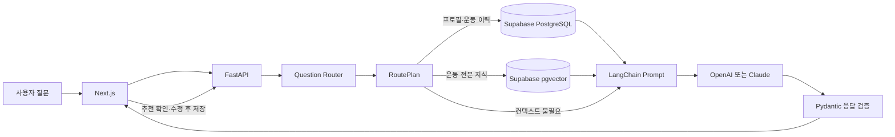

<p align="center">
  
</p>

<h1 align="center">Fit-PT (핏피티)</h1>

<p align="center">
  운동 기록과 전문 지식을 연결하는 AI 퍼스널 트레이너
</p>

<p align="center">
  <strong>Next.js · FastAPI · Supabase · LangChain · pgvector</strong>
</p>

## 프로젝트 소개

Fit-PT는 사용자의 운동 기록과 목표를 기반으로 개인화된 운동 상담과 루틴을 제공하는 AI 퍼스널 트레이너 웹 서비스입니다.

웨이트의 세트·중량과 러닝의 거리·페이스를 기록하고, 누적된 운동 데이터를 바탕으로 AI 트레이너에게 운동 루틴과 중량 조절 방향을 추천받을 수 있습니다. 운동생리학 및 근비대 연구 자료로 RAG 지식베이스를 구축하고 LangChain 기반 검색·응답 파이프라인을 적용해, 일반적인 답변이 아닌 검색된 근거를 활용한 운동 상담을 제공합니다.

AI가 추천한 루틴은 답변으로 끝나지 않습니다. 구조화된 추천 카드를 운동 기록 폼으로 불러와 값을 확인·수정한 뒤 실제 기록으로 저장할 수 있습니다.

## 핵심 기능

| 기능 | 설명 |
| --- | --- |
| 개인화 AI 코칭 | 운동 목표·숙련도·주의 부위와 실제 운동 이력을 질문에 맞게 조합해 답변합니다. |
| 운동 지식 RAG | 논문·가이드 문서를 임베딩하고 Supabase pgvector로 관련 문단을 검색해 답변 근거로 사용합니다. |
| AI 루틴 추천 | 웨이트·러닝·기타 운동 추천을 타입별 구조화 카드로 제공합니다. |
| 추천에서 기록으로 | AI 추천값을 운동 기록 폼에 자동 입력하고, 사용자가 검토·수정한 뒤 저장합니다. |
| 운동 기록 관리 | 웨이트 세트·중량·횟수, 러닝 거리·시간·페이스, 기타 운동을 기록합니다. |
| 캘린더와 통계 | 월별 기록과 주간 운동 시간·웨이트 볼륨·러닝 거리의 변화를 확인합니다. |

## 화면 미리보기

<table>
  <tr>
    <td align="center" width="50%">
      <br />
      <sub><strong>대시보드</strong> — 운동 프로필과 이번 주 요약을 확인하고, 4주·8주 운동량 추세와 주요 기능으로 바로 이동합니다.</sub>
    </td>
    <td align="center" width="50%">
      <br />
      <sub><strong>운동 캘린더</strong> — 날짜별 기록을 운동 타입 색상으로 구분하고 선택한 날의 웨이트·러닝 기록을 조회합니다.</sub>
    </td>
  </tr>
</table>

<table>
  <tr>
    <td align="center" width="50%">
      <br />
      <sub><strong>RAG 운동 상담</strong> — 질문과 의미가 가까운 운동 지식 문단을 검색하고, 답변에 사용한 근거를 자료 번호와 함께 보여줍니다.</sub>
    </td>
    <td align="center" width="50%">
      <br />
      <sub><strong>AI 루틴 추천</strong> — 최근 운동 기록과 프로필을 바탕으로 종목·세트·중량·횟수·휴식 시간이 포함된 루틴 카드를 생성합니다.</sub>
    </td>
  </tr>
</table>

<p align="center">
  <br />
  <sub><strong>추천 루틴 기록</strong> — AI 추천값을 기록 폼에 자동으로 채우고, 실제 수행 내용에 맞게 수정해 나의 운동 기록으로 저장합니다.</sub>
</p>

## AI와 RAG 동작 구조



현재는 모델이 임의로 도구를 선택하는 Tool Calling 방식 대신, 서버가 실행 경로를 통제하는 구조를 사용합니다.

1. 규칙 기반 fast path와 LLM 의미 분류 fallback을 결합한 Router가 질문 의도를 분류합니다.
2. `RoutePlan`이 프로필, 운동 이력 SQL, RAG, 추천 카드 중 필요한 리소스만 선택합니다.
3. 수치·개인 기록은 PostgreSQL에서, 논문·가이드 같은 비정형 지식은 pgvector에서 검색합니다.
4. LangChain이 검색 결과와 사용자 컨텍스트를 프롬프트에 조합합니다.
5. LLM 응답은 Pydantic 계약을 통과한 경우에만 추천 카드와 기록 폼으로 전달됩니다.

개인 운동 기록은 공용 RAG 저장소에 넣지 않으며, 인증된 사용자의 SQL 컨텍스트로만 사용합니다.

## 기술 스택

| 영역 | 기술 |
| --- | --- |
| Frontend | Next.js 15, React 19, TypeScript, Tailwind CSS, shadcn/ui |
| Backend | Python 3.12, FastAPI, Pydantic |
| Database / Auth | Supabase PostgreSQL, Auth, RLS |
| AI | OpenAI 또는 Claude, LangChain |
| RAG | OpenAI Embeddings, Supabase pgvector |
| Test | Python unittest, TypeScript compiler |

## 빠른 시작

### 1. 저장소와 환경 파일 준비

```powershell
git clone https://github.com/kwonup/fit-pt.git
cd fit-pt
Copy-Item apps/web/.env.local.example apps/web/.env.local
Copy-Item apps/api/.env.example apps/api/.env
```

두 환경 파일에 Supabase와 사용할 AI 공급자의 키를 입력합니다. 서버 전용 `SUPABASE_SERVICE_ROLE_KEY`와 AI API 키는 브라우저용 환경 파일이나 Git에 포함하지 마세요.

### 2. 데이터베이스 준비

Supabase SQL Editor에서 [`supabase/migrations`](./supabase/migrations)의 `001_initial_schema.sql`부터 `007_knowledge_rag.sql`까지 번호순으로 실행합니다. RAG 문서 적재 방법은 [RAG 적재 가이드](./docs/rag-ingestion.md)를 참고하세요.

### 3. 백엔드 실행

```powershell
cd apps/api
python -m venv .venv
.\.venv\Scripts\Activate.ps1
python -m pip install -r requirements.txt
python -m uvicorn app.main:app --reload
```

- API: `http://localhost:8000`
- Swagger UI: `http://localhost:8000/docs`

### 4. 프론트엔드 실행

새 터미널에서 다음 명령을 실행합니다.

```powershell
cd apps/web
npm ci
npm run dev
```

- Web: `http://localhost:3000`

### 5. 검증

```powershell
# apps/api
python -m unittest discover -s tests -v

# apps/web
npm exec tsc -- --noEmit --incremental false
```

## 문서

| 문서 | 내용 |
| --- | --- |
| [AI·RAG 운영 가이드](./docs/ai-rag-operations.md) | 질문 분류부터 웹 응답까지의 흐름과 점검 방법 |
| [RAG 문서 적재 가이드](./docs/rag-ingestion.md) | PDF·Markdown 적재, 검색 확인, 재적재 방법 |
| [API 명세](./docs/api-spec.md) | 엔드포인트, 인증, 요청·응답 계약 |
| [DB 설계](./docs/db-schema.md) | 테이블, 관계, RLS, 함수, 벡터 검색 구조 |
| [프로젝트 계획](./docs/project-plan.md) | 구현 범위, 아키텍처와 후속 과제 |

## 프로젝트 정보

| 항목 | 내용 |
| --- | --- |
| 개발 기간 | 2026.06 ~ 2026.08 |
| 팀 구성 | 개인 프로젝트 |
| 담당 범위 | 서비스 기획, UI 설계, 프론트엔드·백엔드 개발, DB 설계, AI·RAG 구현 |
| 저장소 | [github.com/kwonup/fit-pt](https://github.com/kwonup/fit-pt) |

현재 운동 기록 생성·조회·삭제, 개인화 AI 코칭, RAG 검색, 추천 루틴의 기록 전환, 통계 화면까지 구현했습니다. 상세 기록 수정 UI, 채팅 이력 복원, RAG 품질 평가 자동화, 브라우저 E2E와 CI/CD는 후속 과제입니다.
